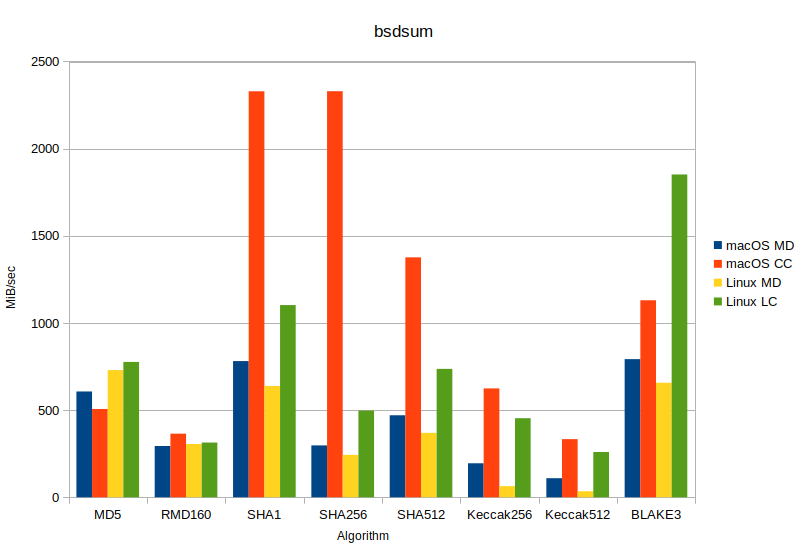
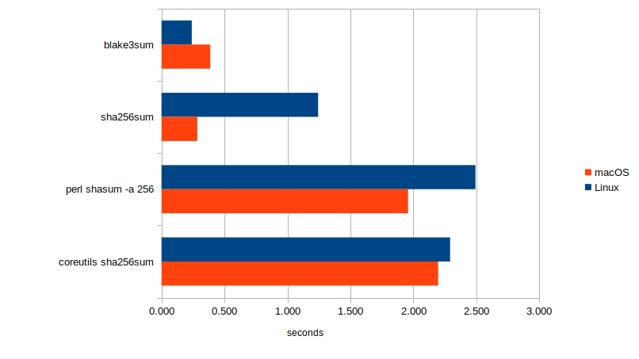

# bsdsum

An updated version of the checksum program from FreeBSD and Darwin.

Adding more algorithms, and more implementations (including Linux).

## FreeBSD

This is the FreeBSD "md5" program, which also does other digests...

`src/sbin/md5`

It uses libmd for the digests, the OpenBSD version is available:

<https://www.hadrons.org/software/libmd/>

## Darwin

It is available on macOS (`/sbin`), but only `md5` has been linked.

`text_cmds/md5`

There it uses CommonCrypto, which is a part of `libSystem.B.dylib`

<https://opensource.apple.com/source/CommonCrypto/>

## Linux

You can also build this for Linux, where it uses openssl libcrypto.

<https://www.openssl.org/>

By setting `MD=true` you can use libmd for checking portability issues.

It is the default on FreeBSD, but optional on macOS and GNU/Linux.

## Algorithms

These algorithms are available (enabled by default show in bold):

- **md5**
- **rmd160**
- **sha1**
- sha224
- **sha256**
- sha384
- **sha512**
- sha512t224
- sha512t256
- skein256
- skein512
- skein1024
- keccak224
- keccak256
- keccak384
- keccak512
- **blake3**

### SHA 123

The six functions `sha224` through `sha512t256` are all part of SHA-2.<br />
[Skein](https://web.archive.org/web/20210401000151/http://www.skein-hash.info/)
was one of the SHA-3 proposals, but in the end it lost to [Keccak](https://keccak.team/).

The software implementations of SHA-3 are twice as slow as SHA-2, but<br />
the hardware implementations of SHA-3 are faster than SHA-1 and SHA-2.

By setting `S3=true` you can use the bundled "libs3" for SHA-3 support.

The default is to use libXKCP, which has both SIMD and generic version:

<https://github.com/XKCP/XKCP>

### BLAKE 123

[BLAKE3](https://blake3.io/) is based on [BLAKE2](https://blake2.net/),
which is based on the SHA-3 proposal BLAKE.

It is faster in software, but yet no common implementations in hardware.

By setting `B3=true` you can use the bundled "libb3" for BLAKE3 support.

The default is to use libblake3, which has both SIMD and portable version:

<https://github.com/BLAKE3-team/BLAKE3>

## Formats

Checksums are normally shown in the full hexadecimal text format, not binary.

The two main formats are the BSD format with algorithm, and the GNU format:

### BSD

`sha256`

```
SHA256 (empty) = e3b0c44298fc1c149afbf4c8996fb92427ae41e4649b934ca495991b7852b855
```

`blake3`

```
BLAKE3 (empty) = af1349b9f5f9a1a6a0404dea36dcc9499bcb25c9adc112b7cc9a93cae41f3262
```

### GNU

`sha256sum`

```
e3b0c44298fc1c149afbf4c8996fb92427ae41e4649b934ca495991b7852b855  empty
```

`blake3sum`

```
af1349b9f5f9a1a6a0404dea36dcc9499bcb25c9adc112b7cc9a93cae41f3262  empty
```

For the GNU format, the algorithm to use is usually determined by file name.

Files can be compared against a string or (sum) file, using the `-c` option.

## Multiformats

See <https://multiformats.io>

### Multihash

The hash includes the function and length:

`<hash-func-type><digest-length><digest-value>`

### Multibase

The multihash is encoding with multibase:

`<base-encoding-code-point><base-encoded-data>`

### Example

Here is the sha256 above, using multiformats:

| Encoding    | Length  | String         							   |
|-------------|---------|--------------------------------------------------------------------------|
| none        | 35      | (binary data, starting with NUL byte - otherwise same hexdump as base16) |
| base16      | 69      | `f1220e3b0c44298fc1c149afbf4c8996fb92427ae41e4649b934ca495991b7852b855`  |
| base32      | 56      | `bciqohmgeikmpyhautl57jsezn64sij5oihsgjg4tjssjlgi3pbjlqvi`               |
| base32hex   | 56      | `v28ge7c648acfo70kjbtv9i4pdusi89te87i696sj9ii9b68rf19bgl8`               |
| base58utc   | 47      | `zQmdfTbBqBPQ7VNxZEYEj14VmRuZBkqFbiwReogJgS1zR1n`                        |

You can use [Multiformat inspector](https://libertydsnp.github.io/multiformat-inspector/) to inspect.

## Benchmark

Comparing the algorithms on two machines, macOS `arm64` and Linux `amd64`.

Showing both the portable MD (BSD) version, and the system CC or LC versions.



`make benchmark` runs the built-in benchmark (the `-t` command line flag)

Note that it uses a small test set: `Digesting 100000 10000-byte blocks`.

## Timing

Comparing the time it takes to checksum the Ubuntu cloud image, 1 thread.

The fastest implementation is 10x faster is than the slowest (default).



On macOS you want to be using `sha256sum`, on Linux instead `blake3sum`.

Assuming that macOS uses aarch64 (arm64), and Linux uses x86_64 (amd64).

---

https://www.freebsd.org/releases/

| FreeBSD Version | Release Year          | Notes                       |
|-----------------|-----------------------|-----------------------------|
| 12.0            | 2018                  | Skein                       |
| 10.0            | 2014                  | SHA-512                     |
| 8.0             | 2009                  |                             |
| 6.0             | 2005                  | Apple fork                  |

https://opensource.apple.com/releases/

| macOS Version   | text_cmds (md5)       | CommonCrypto (CommonDigest) |
|-----------------|-----------------------|-----------------------------|
| 12.1            | text_cmds-118         | CommonCrypto-60190          |
| 11.1            | text_cmds-106         | CommonCrypto-60178.40.2     |
| 10.15           | text_cmds-101.11.1    | CommonCrypto-60165          |
| 10.10           | text_cmds-88          | CommonCrypto-60061          |
